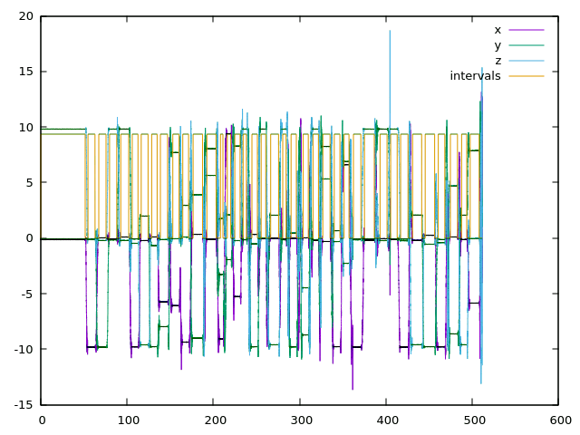
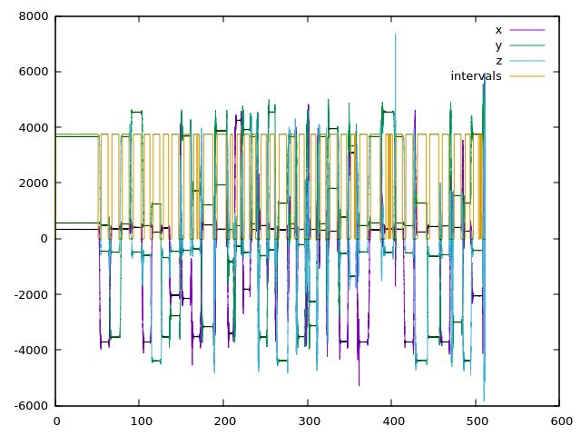

[toc]

# 1. Jacobian Calculations

[calculation](./imu.pdf)

注释：
我将矩阵形式拆开，分别对九个元素求导。
最终的计算结果没有给出，但是给出了偏导联乘的形式


# 2. Imu Calibration with default methods

)

# 3. Imu Calibration with my coding

)

思路

* 由于课件中与代码中下角标不匹配，首先将原来的misYZ改成misYX，其余不变

```c++
    //
    // TODO: implement lower triad model here
    //
    // acc_calib_params[0] = init_acc_calib_.misYZ();
    acc_calib_params[0] = init_acc_calib_.misYX();
    acc_calib_params[1] = init_acc_calib_.misZY();
    acc_calib_params[2] = init_acc_calib_.misZX();
    
    
    acc_calib_params[3] = init_acc_calib_.scaleX();
    acc_calib_params[4] = init_acc_calib_.scaleY();
    acc_calib_params[5] = init_acc_calib_.scaleZ();
    
    acc_calib_params[6] = init_acc_calib_.biasX();
    acc_calib_params[7] = init_acc_calib_.biasY();
    acc_calib_params[8] = init_acc_calib_.biasZ();
```

* 在写Cost Function类的时候，因为计算的过程不一样，我没有使用 类`CalibratedTriad_` 提供的矩阵定义和方法，而是自己与课件对应，分别定义了S, K, b，且自己实现了矩阵的计算过程。

* 最终结果形状类似，但是纵坐标数值差距很大

```c++
template <typename _T1> struct MultiPosAccResidualAnalytic: public ceres::SizedCostFunction<1, 9> {
  MultiPosAccResidualAnalytic(const _T1 &g_mag, const Eigen::Matrix<_T1, 3, 1> &sample)
    : g_mag_(g_mag), sample_(sample) {}
  virtual ~MultiPosAccResidualAnalytic() {}

  virtual bool Evaluate(double const* const* params,
                        double* residuals,
                        double** jacobians) const {

    _T1 Syx = params[0][0];
    _T1 Szy = params[0][1];
    _T1 Szx = params[0][2];
    _T1 Kx = params[0][3];
    _T1 Ky = params[0][4];
    _T1 Kz = params[0][5];
    _T1 bx = params[0][6];
    _T1 by = params[0][7];
    _T1 bz = params[0][8];

    Eigen::Matrix<_T1, 3, 3> Sa_;
    Sa_ << 0.0, 0.0, 0.0,
          -Syx, 0.0, 0.0,
          -Szx, -Szy, 0.0;

    Eigen::Matrix<_T1, 3, 3> Ka_;
    Ka_ << 1/Kx, 0.0, 0.0,
           0.0, 1/Ky, 0.0,
           0.0, 0.0, 1/Kz;

    Eigen::Matrix<_T1, 3, 1> raw_samp;
    raw_samp << double(sample_(0)), 
                double(sample_(1)), 
                double(sample_(2));

    Eigen::Matrix<_T1, 3, 1> bias;
    bias << bx, by, bz;
    
    // apply undistortion transform:
    Eigen::Matrix<_T1, 3, 1> a = Sa_ * Ka_ * (raw_samp - bias);
    
    residuals[0] = double(g_mag_) - a.norm();

    if(jacobians != nullptr && jacobians[0] != nullptr) {
      double Ax = 0.0;
      double Ay = 0.0;
      double Az = -g_mag_;


      Eigen::Matrix<_T1, 3, 1> dy_da = -2 * a;
      Eigen::Matrix<_T1, 3, 1> da_dSyx; 
      da_dSyx << 0, -(Ax-bx)/Kx, 0;
      Eigen::Matrix<_T1, 3, 1> da_dSzx; 
      da_dSzx << 0, 0, -(Ax-bx)/Kx;
      Eigen::Matrix<_T1, 3, 1> da_dSzy; 
      da_dSzy<< 0, 0, -(Ay-by)/Ky;

      Eigen::Matrix<_T1, 3, 1> da_dKx_; 
      da_dKx_ << Ax-bx, -Syx * (Ax - bx), -Szx * (Ax - bx);
      Eigen::Matrix<_T1, 3, 1> da_dKy_;
      da_dKy_ << 0, (Ay - by), -Szy * (Ay - by);
      Eigen::Matrix<_T1, 3, 1> da_dKz_;
      da_dKz_ << 0, 0, (Az - bz);

      Eigen::Matrix<_T1, 3, 1> da_dKx = - 1 / (Kx * Kx) * da_dKx_;
      Eigen::Matrix<_T1, 3, 1> da_dKy = - 1 / (Ky * Ky) * da_dKy_;
      Eigen::Matrix<_T1, 3, 1> da_dKz = - 1 / (Kz * Kz) * da_dKz_;

      Eigen::Matrix<_T1, 3, 1> da_dbx;
      da_dbx << - 1 / Kx, Syx / Kx, Szx / Kx;
      Eigen::Matrix<_T1, 3, 1> da_dby; 
      da_dby << 0, 1 / Kx, Szy / Ky;
      Eigen::Matrix<_T1, 3, 1> da_dbz; 
      da_dbz << 0, 0, 1 / Kz;

      double dy_dSyx = -2 * a.transpose() * da_dSyx;
      double dy_dSzx = -2 * a.transpose() * da_dSzx;
      double dy_dSzy = -2 * a.transpose() * da_dSzy;

      double dy_dKx = -2 * a.transpose() * da_dKx;
      double dy_dKy = -2 * a.transpose() * da_dKy;
      double dy_dKz = -2 * a.transpose() * da_dKz;

      double dy_dbx = -2 * a.transpose() * da_dbx;
      double dy_dby = -2 * a.transpose() * da_dby;
      double dy_dbz = -2 * a.transpose() * da_dbz;

      jacobians[0][0] = dy_dSyx;
      jacobians[0][1] = dy_dSzy;
      jacobians[0][2] = dy_dSzx;
      jacobians[0][3] = dy_dKx;
      jacobians[0][4] = dy_dKy;
      jacobians[0][5] = dy_dKz;
      jacobians[0][6] = dy_dbx;
      jacobians[0][7] = dy_dby;
      jacobians[0][8] = dy_dbz;
    }
  }

  static ceres::CostFunction* Create ( const _T1 &g_mag, const Eigen::Matrix< _T1, 3 , 1> &sample )
  {
    return (new MultiPosAccResidualAnalytic<_T1>( g_mag, sample ));
  }
  
  const _T1 g_mag_;
  const Eigen::Matrix< _T1, 3 , 1> sample_;
};

```